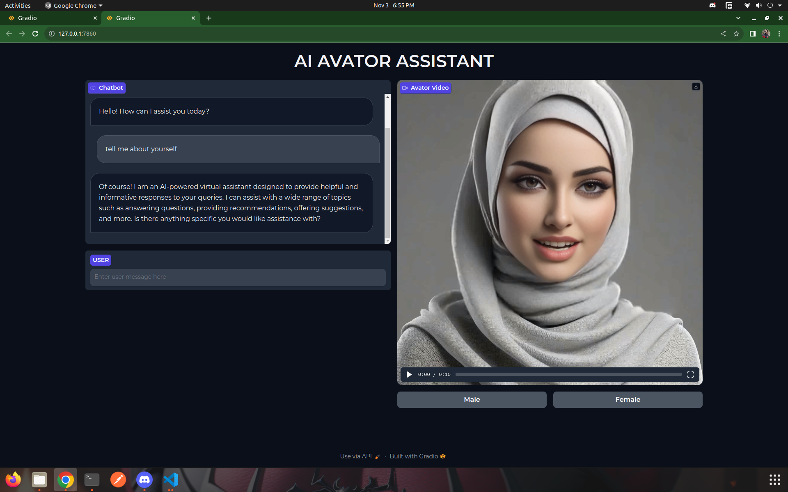

# Ai_Talking_Assistant
<div align="center">
<p>
  </p> 
</div>
 Ai_Talking_Assistant is a chatbot which allow the user to ask any thing and communicate the as.
 * voice
 * video avatar
 * Text

## Setup
  ```code
  conda create -n <env_name> python==3.8
  conda activate <env_name>
  git clone https://github.com/USTAADCOM/ai_talking_assistant.git
  cd ai_talking_assistant
  pip install -r requirements.txt -q
  ```
## Download Dependencies
  ```code
  bash script/download_models.sh
  ```
## Download Models
 * Download models from releases
 * * mapping_00109-model.pth.tar
 * * mapping_00229-model.pth.tar
 * * SadTalker_V0.02_256.safetensors
 * * SadTalker_V0.02_512.safetensors
## Run Gradio Demo
```code
python3 app.py 
```
